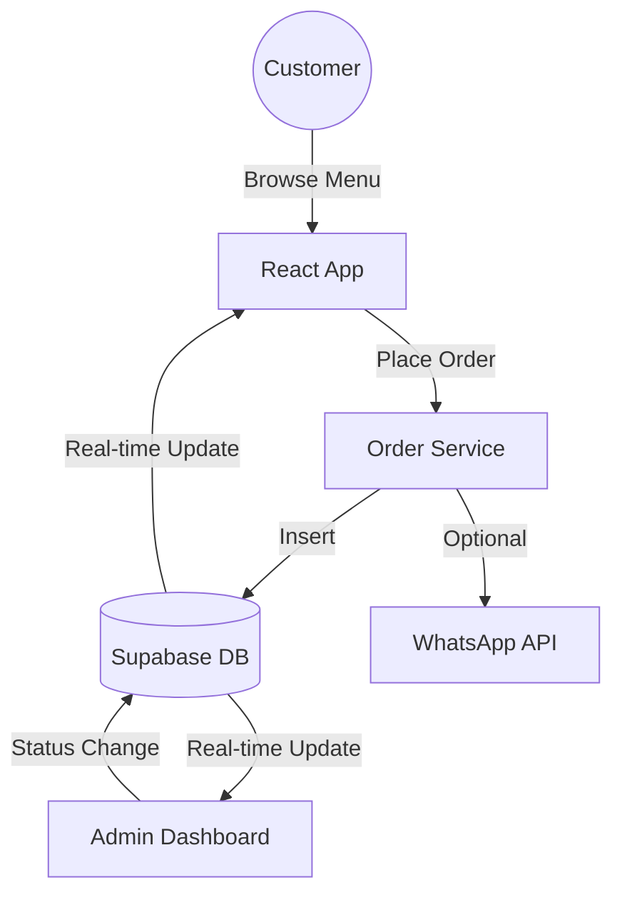

# 📘 Fortaleza Digital Menu - Project Documentation

## 1. Introduction
**Fortaleza Digital Menu** is a sophisticated, real-time ordering platform designed for modern restaurants. It streamlines the customer ordering experience and provides staff with a powerful dashboard for real-time order management.

### Tech Stack
- **Frontend**: React (Vite), TypeScript, Tailwind CSS
- **Database/Backend**: Supabase (PostgreSQL)
- **Real-time**: Supabase Real-time Channels
- **UI Architecture**: Shadcn/UI, Lucide Icons, Framer Motion (for smooth transitions)
- **State Management**: React Context + TanStack Query

---

## 2. System Architecture

### High-Level Flow
The system manages orders through a dual-channel communication strategy: internal database tracking for the kitchen and WhatsApp notifications for immediate staff alerts.



### Order Lifecycle
Orders transition through various states, precisely tracked for operational efficiency:
`Pending` → `Confirmed` → `Preparing` → `Ready` → `Delivered`

---

## 3. Database Reference

### Table: `orders`
The central hub for all transaction data.

| Column | Type | Description |
| :--- | :--- | :--- |
| `id` | UUID | Primary key, auto-generated. |
| `order_number` | Integer | Sequential customer-facing ID. |
| `items` | JSONB | Array of objects `{id, name, quantity, price, category}`. |
| `total_price` | Decimal | Final order value. |
| `customer_name` | Text | Name provided by customer. |
| `customer_table`| Text | Table number or location. |
| `status` | Text | Lifecycle state (pending, preparing, etc.). |
| `sent_via_whatsapp`| Boolean | If WhatsApp notification was triggered. |

### Real-time View
The system utilizes a PostgreSQL view `order_statistics` for the admin dashboard to provide "Today at a Glance" metrics.

---

## 4. Key Services & Components

### `OrderService` (`src/services/orderService.ts`)
The core business logic layer.
- **`createOrder()`**: Initializes orders, handles sequence generation via Supabase RPC.
- **`updateOrderStatus()`**: Manages state transitions and triggers real-time events.
- **`subscribeToOrders()`**: Establishes the WebSocket connection for live dashboard updates.

### Admin Dashboard (`src/pages/AdminDashboard.tsx`)
A secure, real-time view of all active orders.
- **Filtering**: View orders by status (Pending, Preparing, Ready).
- **Actions**: Update status, delete orders, and view customer notes.

---

## 5. Setup & Deployment

### Environment Variables
Configure these in your `.env` file:
```env
VITE_SUPABASE_URL=your_project_url
VITE_SUPABASE_ANON_KEY=your_anon_key
```

### Local Development
1. Install dependencies: `npm install`
2. Start dev server: `npm run dev`

### Production Deployment
The project is optimized for deployment on platforms like Netlify or Vercel. Ensure `netlify.toml` is configured for React Router redirects.

---

## 6. Security
- **Admin Access**: Protected via a frontend password gate (`/admin-login`). 
- **Row Level Security (RLS)**: Enabled on Supabase to ensure data integrity.

---

## 7. Operational FAQ
**Q: How do order numbers work?**
A: They are generated via a Supabase sequence (`get_next_order_number`) to ensure uniqueness even under high concurrency.

**Q: Can customers track their orders?**
A: Yes, the "History" tab in the cart uses `localStorage` to identify the customer and fetches their real-time status from the database.
